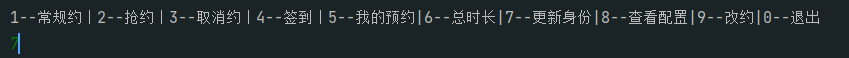

# GZHU_Library_Automation

GZHU图书馆自动化脚本

## 功能

- 座位(自动预约,自动签到)
- 研讨室(自动预约)
- 更多(在`Shell.py`会呈现)

## 结构

```txt

├── user            
│   ├── shell.py      	#开启控制台
│   ├── reserve.py		#定时预约脚本
│   ├── clock.py		#定时签到脚本
│   ├── userInfo.json 	#用户的账户信息
│   ├── schedule.py		#用户的预约信息
│   ├── cookie.txt		#用户的cookie
├── src
│   ├── __init__.py
│   ├── Login.py      	# 登陆类
│   ├── Public.py     	# 公共函数库
│   ├── Shell.py    	# 控制台类
│   ├── User.py    		# 用户操作类
│   └── rsa.py    	 	# RSA 加密算法的实现
├── README.md
└── requirements.txt # 依赖项
```

## 运行

> ### 配置

1. 获取代码

2. 安装依赖

   ```sh
   pip install -r requirements.txt
   ```

3. 配置个人信息,修改`user/userInfo.json` (按里面的提示修改)

4. 配置预约信息,修改`user/schedule.py` (按里面的提示修改)

5. 每个user文件夹代表一名用户,可以多个用户,user**文件夹名**可以**随便改**(比如你的名字),其他文件名不能改哦,

6. 配置好后,执行`user/shell.py`

   1. 选择**更新身份**(第一次配置用户需要点)

      

   2. 然后选择**退出**

   3. 打开`user/userInfo.json`中的`selfAccid`字段更新了,说明脚本配置成功了

   4. 脚本怎么用看个人发挥了

## 待实现

- [ ] 研讨室的签到


